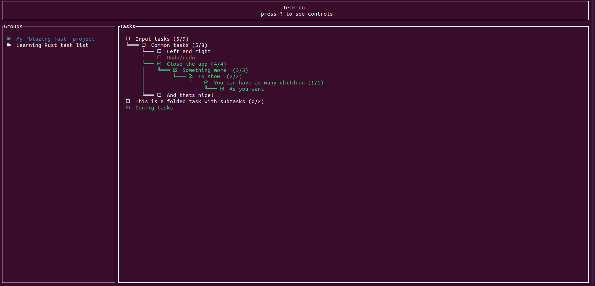

# Term-do
This is a small terminal application for tracking tasks and also my first Rust project! This might not be the most complete and complex task application for terminal ever, but it does a perfect job!

The app is divided in 2 main blocks, Blocks group and Tasks group.

We can have as many Groups as we want and each group has its own set of tasks. Groups are
completely independent one from each other.

Inside the groups we can create as many tasks and subtasks as needed and mark them as done or undone and fold 
them if a task has subtasks.

Controls are specified inside the application by pressing '?'.

Configuration is coming in the version 0.6!

I've been using this app during the development of this app, and it is really useful for software development in general.

Any error you find you can contact me, and I'll try to fix it as soon as possible!