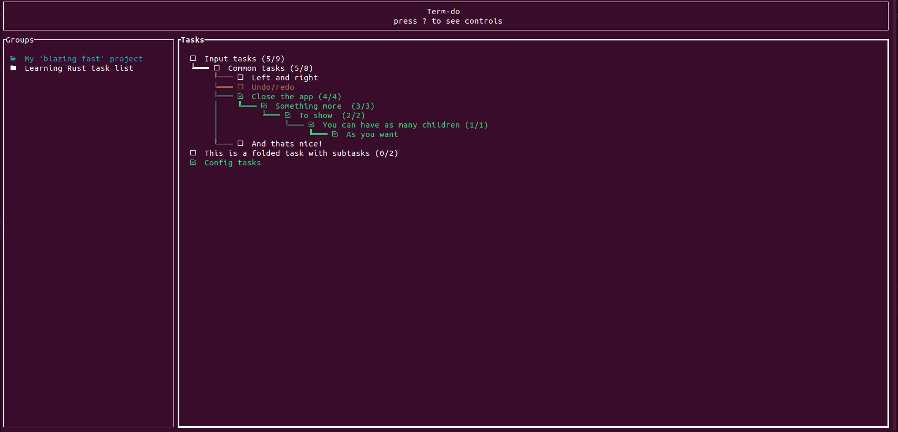

# Term-do
This is a small terminal application for tracking tasks and also my first Rust project! This might not be the most complete and complex task application for terminal ever, but it does a perfect job!

PRE-REQUISITES!! -> Font nerd installed or any other font that is able to render icons!! Otherwise, icons won't be rendered

The app is divided in 2 main blocks, Blocks group and Tasks group.

We can have as many Groups as we want and each group has its own set of tasks. Groups are
completely independent one from each other.

Inside the groups we can create as many tasks and subtasks as needed and mark them as done or undone and fold 
them if a task has subtasks.

Controls are specified inside the application by pressing '?'.

The configuration file for basic customization is alongside the executable, it is a file called settings.ini. It allows you to modify the colors of the text, the borders and the icons.

I've been using this app during the development of this app, and it is really useful for software development in general.

Any error you find you can contact me (vazquezborja@hotmail.es), and I'll try to fix it as soon as possible!

### Version 0.7

In this version it was added:
- Custom key bindings for the app through the settings.ini. Every single char is accepted, F(1...12) not yet and special chars are supported as long as crossterm accepts them (https://docs.rs/crossterm/0.17.7/crossterm/event/enum.KeyCode.html)
- 4 command line commands have been added:
  - --set-settings-path _path_ : this commands sets the dir (set just the dir, do not include the file name, which btw MUST be settings.ini) where your custom settings.ini is located. Now settings will be loaded from that file and not the default one. To go back to the default one set the _path_ value to . 
  - --set-data-path _path_ : exactly the same as above but for the data file (set just the dir, do not include the file name, which btw MUST be data.json).
  - --create-data-in-path _path_ : creates a data.json at the provided _path_. It does not set it as the new path, for that call '--set-data-path'
  - --create-settings-in-path _path_ : creates a settings.ini at the provided _path_. It does not set it as the new path, for that call '--set-settings-path'